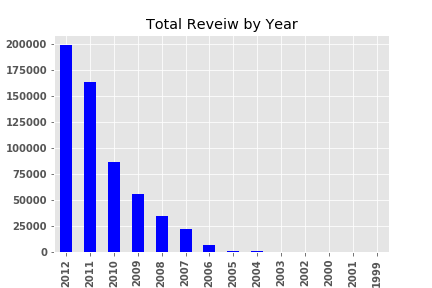
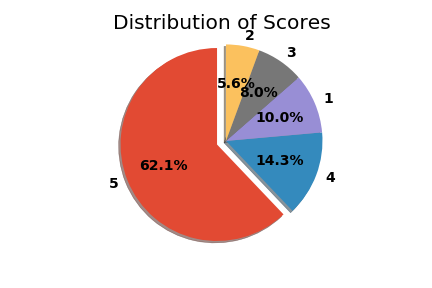
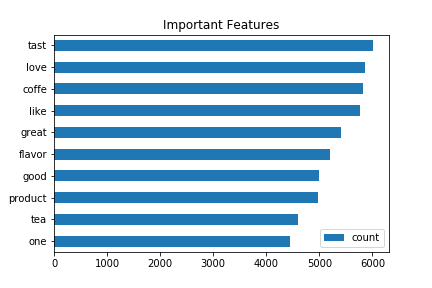
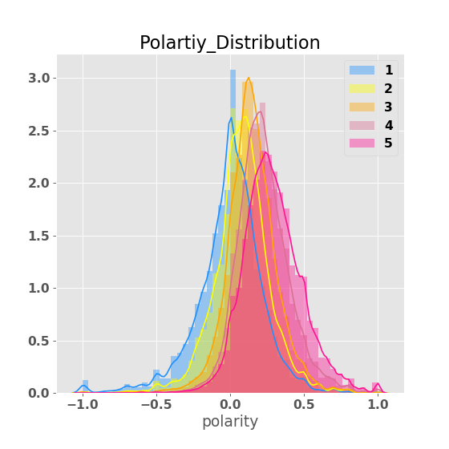
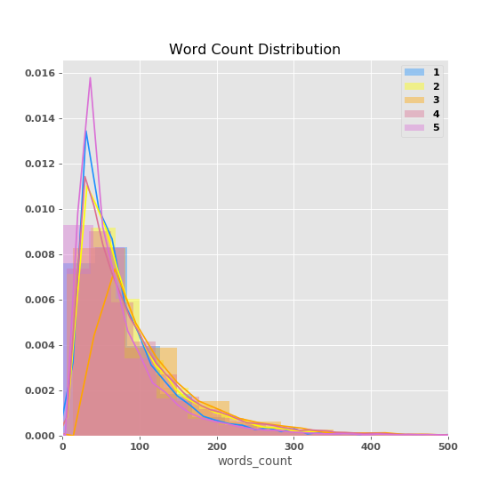

## Amazon Review Anaylsis

- Motivation and Objective
- Data 
- EDA
- Data Preprocessing
- Binary Classifier (0,1)
- Multiple Classifier (1-5)
- Conclusion 

## Motivation 
After learning about Natural Language Processing and Text Classification, I found them interesting and wanted to learn more about them by practicing.
Initially, I wanted to use the transcripts of TOP 10 TED speech and to find out most common persuasive words that TOP speakers were using so that I could improve my communication skill.
Unfortauntely, my interesting purpose was derive from that of the second capstone, which is foucsed on creating Machine Learning Model and then predicting something. 
So I moved on to using Amazon Review data that I found out from Kaggle that satisfied not only the second proeject's purpose, but also my interest. 

## Objective
1. Understand the data of the previous amazon reviews
2. Analyze which features in the dataset or specific words are significant indicators that help us to predict scores that reviews would give
3. Create a model that predict scores after learning the amazon review's pattern
4. Compare the predictive and actual scores, find reasons if gaps are large
5. Tune the model to produce better performances
6. Find the best model!

## Data 
Amazon Review Data can be found in [here](https://www.kaggle.com/snap/amazon-fine-food-reviews)

The original amazon review data has 568K rows with 10 features. 
- Reviews from Oct 1999 - Oct 2012
- 568,454 reviews
- 256,059 users
- 74,258 products
- 260 users with > 50 reviews
- no missing values
- Scores from 1 to 5 (5 is the highest score, while 1 is the lowest score)

## EDA

* Reviews from 2011 to 2012, which consists of 60 % of the original data

* 62% of the reviewers gave 5 score, which means the data is imbalanced
 

* The most common words found in 2011 and 2012

* Sentiment Analysis
input - A corpus. "great" = positive, "not great" = negative
The library of TextBlob provides Polarity(-1 to 1) and Subjectivity(0 to 1) score 
The more subjective you are, the more opinion you are 
ex) "I love TextBlob" - gives polarity 0.5 and subjectivity 0.6 

  - The polarity distribution shows that the higher scores are likely to have positive polarity, while the lower scores do negative polarity 

  - The subjectivity distribution plot shows that the reviewer who were not satistifed with the products that they bought from Amazon     were very opinion because they needed to complain!
  
* Word Counts
After EDA analysis, I noticed that there were kind of pattern the length of the reviews depending on the level of the scores

## Data Preprocessing

1. Selected the data from 2011 and 2012. 
2. Cleaned the data in Text columns -> lower text, remove numbers, special chars ( !@$), stop words including ive andlemmatize text.
3. Split the dataset into train and test dataset.
4. From Doc2Vec and TaggedDocumnet module in Genism, created the five different kinds of Doc2Vec vectors based on each review. The vectors generated by doc2vec can be used for tasks like finding similarity between sentences/paragraphs/documents. (Same texts will also have similar representations and that is why we can use those vectors as training features)

## Binary Classifier
 From the train dataset, choose the data that contains either score 1, 2 or 5 and then relabeled them as 1,2 were 0, which meant bad review while 5 were 1 as good review -> In this way, I was able to better understand a model's work and to easily compare the models with different features or different parameter.

Feature 1 = word count, unique words, polarity, subjectivity, Doc2Vectors + HelpfulnessNumerator + HelpfulnessDenominator

Feature 2 = word matrix created by either CounterVectorizer or TFID

Feature 3 = Feature 1 & Feature 2

 | Step | Model |  features   |  Changes   |  Accuracy Score  |
 | ---- | ----- |  --------   |  -------   |  --------------  |
 | 1    | LogisticRegression | Feature 1 | -- |   79.9%  |
 | 2   | GradientBoostingClassifier | Feature 1 | -- |   80.2%  |
 | 4    | RandomForestClassifier | Feature 1 | -- |   83%  |
 | 5    | RandomForestClassifier | Feature 2 | CounterVectorizer |   90.15%  |
 | 6    | RandomForestClassifier | Feature 2 | TFidVectorizer |   90.12%  |
 | 7    | RandomForestClassifier | Feature 3 |  --  |   90.5%  |
 | 8    | RandomForestClassifier | Feature 4 |  max_features = 6000 & n_estimator= 250  |   93.0%  |
 
  - Notice that the accuracy scores were based on 20% test size of split-train-test. If the test size were 30% then the accoracy score went down a little bit. 
  - The accuracy score could go up if tunning the parameters.  
 
 ## Multiple Classifier
 Starting with the model that produced the best performance on the binary classification, I tried to predict multiple classification, which were scroes from 0 to 5.
 
This process was the same as that for binary classifier.

Feature 1 = word count, unique words, polarity, subjectivity, Doc2Vectors + HelpfulnessNumerator + HelpfulnessDenominator

Feature 2 = word matrix created by either CounterVectorizer or TFID

Feature 3 = Feature 1 & Feature 2

 | Step | Model |  features   |  Accuracy Score  | Near Score |
 | ---- | ----- |  --------   |  --------------  | ----|
 | 1    |RandomForestClassifier | Feature 1 |   49.3%  | 78.6% |
 | 2   | RandomForestClassifier | Feature 2 |  61.2%  | 84.8% |
 | 3  | RandomForestClassifier | Feature 3 |  61.7%  | 85.3% |
 | 4  | RandomForestRegressor | Feature 3 | 50.2 %  | 85.1% |
 | 5  | MutlinomialNB | Feature 3 without polarity & Doc2Vecs | 49.2 %  | 82.2% |
 | 6  | SGDClassifier | Feature 3  | 35.6 %  | 60.9% |

